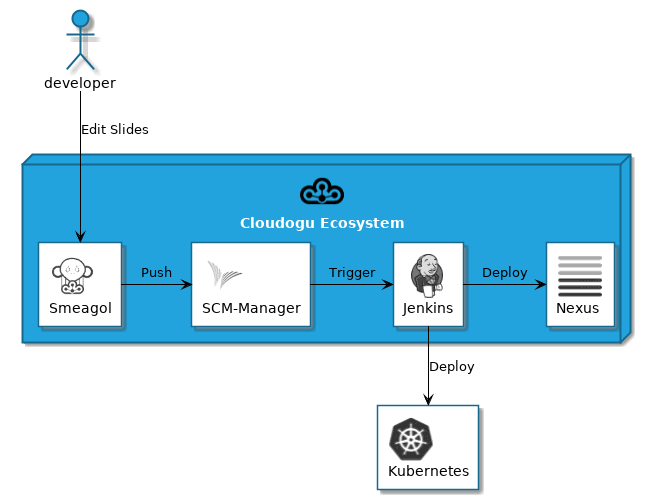

# plantuml-bmclab-common

# Sprites for PlantUML

This repository includes a set of logos from [BMCLAB EcoSystem](https://cloudogu.com/?mtm_campaign=sprites&mtm_kwd=website&mtm_source=github&mtm_medium=link) Dogus and other tools for using as [Sprites](http://plantuml.com/sprite) in [PlantUML](http://plantuml.com). BTW: Check out our Git based wiki [Smeagol](https://github.com/cloudogu/smeagol) which has rich PlantUML support!

This work was inspired by [tupadr3/plantuml-icon-font-sprites](https://github.com/tupadr3/plantuml-icon-font-sprites). (Note: if you use their sprites in the same PlantUML diagram with sprites from this repo, you don't have to include the file common.puml from their repo. The code is already in common.puml of this repo.)

## Usage

First include the file common.puml either via path or url. It also contains style definitions according to the BMCLAB CI

```
[...]
!include ../common.puml
!includeurl https://raw.githubusercontent.com/bmclab-git/plantuml-bmclab-common/main/common.puml
[...]
```
You can define a macro for the URL

```
[...]
!define BMCLABURL https://raw.githubusercontent.com/bmclab-git/plantuml-bmclab-common/main
!includeurl BMCLABURL/common.puml
[...]
```

Then include the sprites that you want to use 

```
[...]
!includeurl BMCLABURL/dogus/scm.puml
!includeurl BMCLABURL/dogus/smeagol.puml
[...]
```

To use the Sprites you can include their name directly with <<$name>>

```
[...]
node "BMCLAB Ecosystem" <<$cloudogu>> {
[...]
```

or add one of the defined macros. Prefix can be either 'DOGU' or 'TOOL':

```
[...]
<prefix>_<name>(alias)
<prefix>_<name>(alias,label)
<prefix>_<name>(alias,label,shape)
<prefix>_<name>(alias,label,shape,color)
[...]
```

## Complete Example
```
@startuml
!define BMCLAB https://raw.githubusercontent.com/bmclab-git/plantuml-bmclab-common/main
!includeurl BMCLAB/common.puml
!includeurl BMCLAB/dogus/jenkins.puml
!includeurl BMCLAB/dogus/cloudogu.puml
!includeurl BMCLAB/dogus/scm.puml
!includeurl BMCLAB/dogus/smeagol.puml
!includeurl BMCLAB/dogus/nexus.puml
!includeurl BMCLAB/tools/k8s.puml

node "BMCLAB Ecosystem" <<$cloudogu>> {
	DOGU_JENKINS(jenkins, Jenkins) #ffffff
	DOGU_SCM(scm, SCM-Manager) #ffffff
	DOGU_SMEAGOL(smeagol, Smeagol) #ffffff
	DOGU_NEXUS(nexus,Nexus) #ffffff
}

TOOL_K8S(k8s, Kubernetes) #ffffff

actor developer

developer -> smeagol : "Edit Slides"
smeagol -> scm : Push
scm -> jenkins : Trigger
jenkins -> nexus : Deploy
jenkins -> k8s : Deploy

@enduml
```



## List of all Dogu Sprites

| Sprite | Dogu name | Macro | Name |
|--------|-----------|-------|------|
|  | CAS | DOGU_CAS | $cas |
|  | Cloudogu | DOGU_CLOUDOGU | $cloudogu |
|  | Cockpit | DOGU_COCKPIT | $cockpit |
|  | Jenkins | DOGU_JENKINS | $jenkins |
|  | Nexus | DOGU_NEXUS | $nexus |
|  | Nginx | DOGU_NGINX | $nginx |
|  | OpenLDAP | DOGU_OPENLDAP | $openldap |
|  | PlantUML | DOGU_PLANTUML | $plantuml |
|  | Postfix | DOGU_POSTFIX | $postfix |
|  | PostgreSQL | DOGU_POSTGRESQL | $postgresql |
|  | Redmine | DOGU_REDMINE | $redmine |
|  | Registrator | DOGU_REGISTRATOR | $registrator |
|  | SCM Manager | DOGU_SCM | $scm |
|  | Smeagol | DOGU_SMEAGOL | $smeagol |
|  | Sonarqube | DOGU_SONARQUBE | $sonarqube |
|  | User management | DOGU_USERMGMT | $usermgmt |
|  | LDAP mapper | DOGU_LDAPMAPPER | $ldapmapper |
|  | jira | DOGU_JIRA | $jira |
|  | confluence | DOGU_CONFLUENCE | $confluence |
|  | backup | DOGU_BACKUP | $backup |
|  | easyredmine | DOGU_EASYREDMINE | $easyredmine |
|  | portainer | DOGU_PORTAINER | $portainer |
|  | swaggerui | DOGU_SWAGGERUI | $swaggerui |
|  | admin | DOGU_ADMIN | $admin |

## List of all other tools sprites

| Sprite | Tool name | Macro | Name |
|--------|-----------|-------|------|
|  | Ansible | TOOL_ANSIBLE | $ansible |
|  | Cucumber | TOOL_CUCUMBER | $cucumber |
|  | Cypress | TOOL_CYPRESS | $cypress |
|  | Docker | TOOL_DOCKER | $docker |
|  | Elastic Search | TOOL_ELASTIC | $elastic |
|  | Etcd | TOOL_ETCD | $etcd |
|  | fail2ban | TOOL_FAIL2BAN | $fail2ban |
|  | Grafana | TOOL_GRAFANA | $grafana |
|  | Gatsby | TOOL_GATSBY | $gatsby |
|  | JUnit | TOOL_JUNIT | $junit |
|  | Kubernetes | TOOL_K8S | $k8s |
|  | Prometheus | TOOL_PROMETHEUS | $prometheus |
|  | QEmu | TOOL_QEMU | $qemu |
|  | React | TOOL_REACT | $react |
|  | Terraform | TOOL_TERRAFORM | $terraform |
|  | Ubuntu | TOOL_UBUNTU | $ubuntu |
|  | Virtualbox | TOOL_VIRTUALBOX | $virtualbox |
|  | VMWare | TOOL_VMWARE | $vmware |

## Adding new sprites

Only a few things are needed to create new sprites:

1. a 48x48 pixel bitmap image
1. the [plantuml.jar](https://sourceforge.net/projects/plantuml/files/plantuml.jar/download)
1. a working Java installation

Images work best when they have a white background (that is: no alpha/transparency channel is visible) and show a good contrast.

### Steps

1. prepare the input image
1. encode the input image to a Plant UML sprit`
   - `java -jar /path/to/plantuml.jar -encodesprite 16 yourSprite.png > yourSprite.puml`
1. optional, but it just would be nice:
   1. harmonize sprite file to match existing ones
      - add @startuml / @enduml tags
      - add ENTITY stuff (see the other .puml files)
   1. Share here

---

All trademarks, product names and logos appearing above are the property of their respective owners, including in some instances Cloudogu GmbH. Any rights not expressly granted herein are reserved.

---
### What is the Cloudogu EcoSystem?
The Cloudogu EcoSystem is an open platform, which lets you choose how and where your team creates great software. Each service or tool is delivered as a Dogu, a Docker container. Each Dogu can easily be integrated in your environment just by pulling it from our registry. We have a growing number of ready-to-use Dogus, e.g. SCM-Manager, Jenkins, Nexus, SonarQube, Redmine and many more. Every Dogu can be tailored to your specific needs. Take advantage of a central authentication service, a dynamic navigation, that lets you easily switch between the web UIs and a smart configuration magic, which automatically detects and responds to dependencies between Dogus. The Cloudogu EcoSystem is open source and it runs either on-premises or in the cloud. The Cloudogu EcoSystem is developed by Cloudogu GmbH under [MIT License](https://cloudogu.com/en/license/?mtm_campaign=sprites&mtm_kwd=license&mtm_source=github&mtm_medium=link).

### How to get in touch?
Want to talk to the Cloudogu team? Need help or support? There are several ways to get in touch with us:

* [Website](https://cloudogu.com/?mtm_campaign=sprites&mtm_kwd=website&mtm_source=github&mtm_medium=link)
* [myCloudogu-Forum](https://forum.cloudogu.com/topic/34?ctx=1)
* [Email hello@cloudogu.com](mailto:hello@cloudogu.com)

---
&copy; 2020 Cloudogu GmbH - MADE WITH :heart: FOR DEV ADDICTS. [Legal notice / Impressum](https://cloudogu.com/en/imprint/?mtm_campaign=sprites&mtm_kwd=imprint&mtm_source=github&mtm_medium=link)
